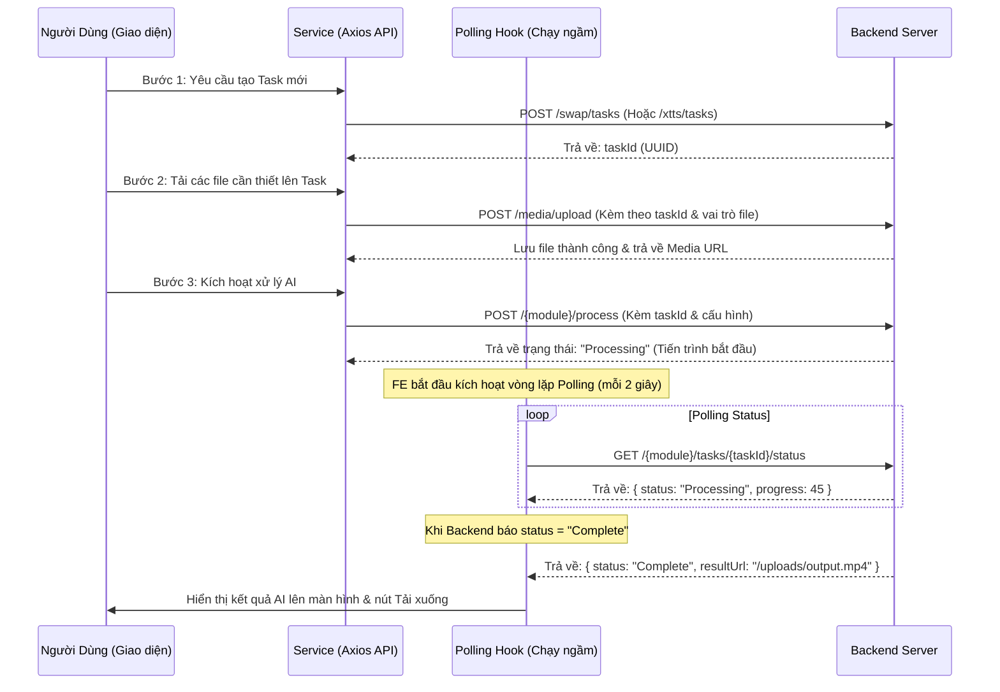

# Hướng Dẫn Chi Tiết Kiến Trúc & Cách Hoạt Động Của Frontend (Hyra AI)

Tài liệu này giải thích chi tiết cấu trúc thư mục, luồng chạy dữ liệu, cách phân chia file và các khái niệm cốt lõi trong phần Frontend (React / Vite) của dự án **Hyra AI**.

---

## 1. Cấu Trúc Thư Mục (Directory Structure)

Thư mục `frontend/src` được phân chia theo mô hình mô-đun (modular) rõ ràng nhằm tách biệt giao diện hiển thị, logic nghiệp vụ và kết nối API.

```text
src/
├── assets/         # Tài nguyên tĩnh (Hình ảnh, video, icons, fonts)
├── components/     # Các thành phần giao diện (UI Components)
│   ├── auth/       # Giao diện Đăng nhập, Đăng ký (LoginModal, RegisterModal)
│   ├── profile/    # Trang cá nhân, Lịch sử tác vụ (SwapHistory, ProfileInfo)
│   ├── swap/       # Các mô-đun AI chính (ImageSwap, VideoSwap, TextToSpeech, MegaWorkflow)
│   └── layout/     # Khung sườn giao diện (Sidebar, Navbar, Layout chung)
├── hooks/          # Custom Hooks (Logic xử lý nghiệp vụ, Polling trạng thái AI)
│   ├── useSwapTaskPolling.js
│   ├── useXttsTaskPolling.js
│   └── useMegaTaskPolling.js
├── services/       # Lớp giao tiếp API (Call API đến Spring Boot Backend)
│   ├── api.js      # Cấu hình Axios Instance chung (Thêm Token, xử lý lỗi 401)
│   ├── authService.js
│   ├── swapService.js
│   ├── xttsService.js
│   └── whisperService.js
├── stores/         # Quản lý trạng thái toàn cục (Zustand State Store)
│   └── authStore.js
├── utils/          # Các hàm tiện ích dùng chung (Helper functions)
│   ├── mediaUrl.js     # Giải quyết đường dẫn URL tĩnh/động từ Backend
│   └── taskProgress.js # Xử lý tính toán phần trăm tiến độ tác vụ
├── App.jsx         # Component gốc quản lý Routing và hiển thị chung
└── main.jsx        # Điểm khởi đầu của ứng dụng React (Khởi tạo DOM)
```

---

## 2. Cách Hoạt Động Của Các Mô-đun AI (AI Workflows)

Mọi tính năng xử lý AI trong hệ thống (như Face Swap, Voice Clone XTTS, Mega Workflow) đều chạy theo **Mô hình Bất đồng bộ (Asynchronous Task Processing)** do AI cần thời gian dài để xử lý (từ vài giây đến vài phút). 

Quy trình chạy chuẩn giữa FE và BE gồm 4 bước chính:



---

## 3. Chi Tiết Các Lớp Trong Code Frontend

### A. Lớp Dịch Vụ (Services Layer)
Nằm trong thư mục `src/services/`. Lớp này đảm nhận việc chuyển đổi dữ liệu và thực hiện các yêu cầu HTTP (GET, POST...) đến Backend. 

*Ví dụ về `src/services/xttsService.js`:*
```javascript
import api from './api'; // Axios instance đã cấu hình sẵn Token Đăng nhập

const xttsService = {
    // 1. Tạo một phiên làm việc XTTS mới trên BE
    createTtsTask: async () => {
        const response = await api.post('/xtts/tasks');
        return response.data; // Trả về { code: 200, result: "taskId_abc..." }
    },

    // 2. Tải tệp giọng nói mẫu của người dùng lên
    uploadVoiceToTtsTask: async (file, taskId) => {
        const formData = new FormData();
        formData.append('file', file);
        formData.append('taskId', taskId);
        formData.append('role', 'audio'); // Đánh dấu vai trò file là voice sample

        const response = await api.post('/media/upload', formData, {
            headers: { 'Content-Type': 'multipart/form-data' }
        });
        return response.data;
    },

    // 3. Yêu cầu bắt đầu nhân bản giọng nói theo văn bản
    processTtsTask: async (taskId, text, language = 'vi') => {
        const response = await api.post(`/xtts/tasks/${taskId}/process`, {
            text,
            language
        });
        return response.data;
    },

    // 4. Lấy trạng thái của Task (Dùng cho Polling)
    getTtsTaskStatus: async (taskId) => {
        const response = await api.get(`/xtts/tasks/${taskId}/status`);
        return response.data;
    }
};

export default xttsService;
```

---

### B. Lớp Hooks (Business Logic / Polling)
Nằm trong thư mục `src/hooks/`. Lớp này quản lý các tác vụ lặp đi lặp lại hoặc các logic phức tạp nằm ngoài tầm kiểm soát của giao diện hiển thị.

*Ví dụ về cách hoạt động của Polling Hook (`src/hooks/useXttsTaskPolling.js`):*
```javascript
import { useCallback, useEffect, useRef } from 'react';
import xttsService from '../services/xttsService';

export function useXttsTaskPolling({ onProgress, onComplete, onFailed }) {
    const intervalRef = useRef(null); // Lưu trữ ID của setInterval để tắt khi cần

    const stopPolling = useCallback(() => {
        if (intervalRef.current) {
            clearInterval(intervalRef.current);
            intervalRef.current = null;
        }
    }, []);

    const startPolling = useCallback((taskId) => {
        stopPolling(); // Reset nếu có vòng lặp trước đó đang chạy

        const tick = async () => {
            try {
                // Gọi API lấy trạng thái từ Backend
                const { result: task } = await xttsService.getTtsTaskStatus(taskId);

                // Cập nhật % tiến độ cho giao diện hiển thị
                if (task?.progress !== undefined) {
                    onProgress?.(task.progress);
                }

                 // Nếu Backend báo lỗi
                if (task?.status === 'Failed') {
                    stopPolling();
                    onFailed?.(task);
                }

                // Nếu xử lý xong hoặc đã có URL kết quả
                if (task?.status === 'Complete' || task?.resultUrl) {
                    stopPolling();
                    onComplete?.(taskId, task);
                }
            } catch (err) {
                console.error("Lỗi khi lấy trạng thái:", err);
            }
        };

        tick(); // Chạy ngay lập tức lần đầu
        intervalRef.current = setInterval(tick, 2000); // Lặp lại mỗi 2 giây
    }, [onProgress, onComplete, onFailed, stopPolling]);

    // Khi component bị đóng (Unmount), tự động tắt vòng lặp tránh rò rỉ bộ nhớ
    useEffect(() => () => stopPolling(), [stopPolling]);

    return { startPolling, stopPolling };
}
```

---

### C. Lớp Giao Diện (Components Layer - Giao diện hiển thị)
Nằm trong thư mục `src/components/`. Nhiệm vụ của lớp này là định nghĩa mã HTML (JSX) và CSS của giao diện, đồng thời bắt các hành động bấm nút, nhập văn bản của người dùng để kích hoạt các Service/Hook.

*Ví dụ cách gọi trong component giao diện chính (`TextToSpeech.jsx`):*
```javascript
// Khai báo hook polling
const { startPolling, stopPolling } = useXttsTaskPolling({
    onProgress: (pct) => {
        setProgress(pct);
        setMessage(`Đang xử lý giọng nói... ${pct}%`);
    },
    onComplete: (taskId, task) => {
        setProgress(100);
        setResultAudioUrl(task.resultUrl); // Lưu lại URL kết quả để phát nhạc
        setSwapDone(true);
        setIsLoading(false);
    },
    onFailed: () => {
        setError('Xử lý thất bại. Vui lòng thử lại.');
        setIsLoading(false);
    }
});

// Hàm kích hoạt xử lý khi nhấn nút "AI Swap Giọng nói"
const handleExecute = async () => {
    try {
        setIsLoading(true);
        setProgress(0);
        setMessage('Đang khởi tạo...');

        // Bước 1: Tạo Task trên Backend
        const { result: taskId } = await xttsService.createTtsTask();

        // Bước 2: Tải file ghi âm/file mẫu lên
        await xttsService.uploadVoiceToTtsTask(audioFile, taskId);

        // Bước 3: Kích hoạt xử lý
        await xttsService.processTtsTask(taskId, text, 'vi');

        // Bước 4: Chạy Polling ngầm để cập nhật phần trăm tiến độ
        startPolling(taskId);
    } catch (err) {
        setIsLoading(false);
        setError('Đã xảy ra lỗi khi kết nối.');
    }
};
```

---


## 5. Các Mô Hình AI Được Sử Dụng Và Cách Áp Dụng Ở FE

Dự án **Hyra AI** tích hợp 4 công nghệ AI hiện đại để xử lý hình ảnh, âm thanh, video và đồng bộ hóa. Dưới đây là mô tả chi tiết của từng loại AI và cách ứng dụng của chúng ở phía Frontend:

### 1. FaceFusion (AI Hoán Đổi Khuôn Mặt - Face Swap)
* **Khái niệm**: FaceFusion là một thư viện mã nguồn mở chuyên dụng giúp thay thế khuôn mặt của người trong ảnh hoặc video nền (**Target**) bằng khuôn mặt từ một ảnh nguồn (**Source**) một cách tự nhiên (khớp góc độ, ánh sáng và màu da).
* **Ứng dụng ở FE**:
  * **Component sử dụng**: `ImageSwap.jsx` (Hoán đổi ảnh) và `VideoSwap.jsx` (Hoán đổi video).
  * **Cách áp dụng**: 
    1. Giao diện cho phép người dùng kéo thả hoặc tải lên 2 tệp: **Ảnh khuôn mặt nguồn** và **Ảnh/Video đích**.
    2. FE sử dụng thẻ `` và `<video>` để hiển thị bản xem trước (Preview) ngay khi tải lên thành công.
    3. Khi bấm hoán đổi, FE gửi yêu cầu xử lý đến Backend. BE sẽ gọi dòng lệnh FaceFusion ở phía máy chủ.
    4. Tiến trình xử lý (0-100%) được cập nhật liên tục lên giao diện thông qua polling. Khi hoàn tất, URL của video/ảnh kết quả được hiển thị trực quan cho người dùng tải về hoặc lưu trữ.

### 2. XTTS (AI Nhân Bản Giọng Nói - Voice Cloning & Text-To-Speech)
* **Khái niệm**: XTTS là một mô hình sinh giọng nói (TTS) tiên tiến có khả năng nhân bản (clone) giọng nói của một người cụ thể chỉ dựa trên một đoạn ghi âm ngắn (10 - 20 giây). Kết quả tạo ra là một giọng đọc tự nhiên bằng tiếng Việt hoặc tiếng nước ngoài giống hệt người mẫu gốc.
* **Ứng dụng ở FE**:
  * **Component sử dụng**: `TextToSpeech.jsx`.
  * **Cách áp dụng**:
    1. Người dùng có 2 lựa chọn: Tải lên tệp âm thanh có sẵn (`.mp3`, `.wav`) hoặc **Ghi âm trực tiếp** qua Microphone của máy tính/điện thoại.
    2. Ở phần ghi âm trực tiếp, FE sử dụng API **`MediaRecorder`** mặc định của trình duyệt để thu âm, hiển thị thời gian ghi âm thực tế, và xuất ra một tệp âm thanh ảo (Blob).
    3. Người dùng nhập nội dung văn bản (Text) muốn chuyển đổi.
    4. Sau khi gửi dữ liệu lên Backend xử lý XTTS, FE nhận tệp kết quả `.wav` và khởi tạo đối tượng `new Audio(url)` của HTML5 để phát trực tiếp âm thanh nhân bản cho người dùng nghe thử kèm theo hoạt ảnh sóng âm (Soundwave animation) nhảy múa sinh động.

### 3. Whisper / WhisperX (AI Tự Động Tạo Phụ Đề - Speech-To-Text)
* **Khái niệm**: Whisper (phát triển bởi OpenAI) là mô hình nhận dạng giọng nói tự động (ASR). Phiên bản **WhisperX** cải tiến giúp căn chỉnh thời gian bắt đầu và kết thúc của từng từ (word-level timestamps) cực kỳ chuẩn xác, phục vụ tốt cho việc tạo tệp phụ đề `.srt` hoặc ghép lời thoại.
* **Ứng dụng ở FE**:
  * **Component sử dụng**: `WhisperSubtitle.jsx`.
  * **Cách áp dụng**:
    1. Người dùng tải lên tệp âm thanh hoặc video muốn trích xuất phụ đề.
    2. Khi tác vụ hoàn thành, Backend trả về tệp định dạng phụ đề `.srt` chứa nội dung lời thoại đi kèm mốc thời gian.
    3. FE đọc dữ liệu phụ đề và hiển thị dưới dạng một danh sách các câu kèm timeline (Timeline list) để người dùng có thể nhấp chuột vào từng dòng phụ đề để nhảy trực tiếp tới phân đoạn tương ứng trong trình phát video.

### 4. Wav2Lip / LipSync (AI Khớp Khẩu Hình)
* **Khái niệm**: Wav2Lip là mô hình AI giúp biến đổi chuyển động môi (khẩu hình miệng) của người nói trong video sao cho khớp hoàn hảo với bất kỳ file âm thanh tiếng nói nào được cung cấp thêm.
* **Ứng dụng ở FE**:
  * **Component sử dụng**: Nằm trong mô-đun **Mega Workflow** (`MegaWorkflow.jsx`).
  * **Cách áp dụng**:
    1. **Mega Workflow** là quy trình gộp (Workflow): Người dùng tải lên Ảnh mặt người mẫu, Video nền, tệp Giọng nói mẫu và nhập Văn bản mới.
    2. Quy trình xử lý tự động của hệ thống:
       * **Bước A**: FaceFusion hoán đổi mặt người mẫu vào Video nền.
       * **Bước B**: XTTS chuyển đổi Văn bản mới thành tệp âm thanh dựa trên giọng nói mẫu.
       * **Bước C**: **Wav2Lip** lấy video đã swap mặt ở Bước A ghép với âm thanh XTTS ở Bước B để tạo ra video cuối cùng có khẩu hình môi nói khớp từng từ với văn bản mới.
    3. Ở giao diện FE, người dùng được cung cấp một Workspace trực quan hiển thị sơ đồ tuần tự các bước xử lý ngầm. Các trạng thái chuyển từ màu xám (Pending) sang xanh lam (Processing) và cuối cùng là xanh lá (Completed) để người dùng nắm rõ AI đang chạy tới công đoạn nào.
